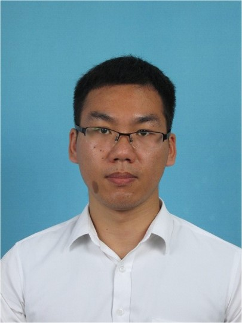

## **王彭彭 郑州大学劳动卫生与环境卫生学专业 直聘研究员**

上海亲子队列核心成员：负责上海亲子队列建设全流程管理

复旦大学环境卫生学博士、博士后，入选复旦大学“超级博士后”激励计划。现为郑州大学直聘研究员。主要研究方向为环境污染与母婴健康。以第一/共同一作在Environ Int、Sci Total Environ、Environ Sci Technol等期刊发表SCI论文13篇（10篇中科院1区）。主持中国博士后科学基金面上项目、博士后站中特别资助项目、上海市青年科技启明星计划（扬帆专项）等资助；参与“十四五”国家重点研发计划1项（项目骨干）；获教育部高等学校科学研究优秀成果奖自然科学二等奖（第五完成人）。 