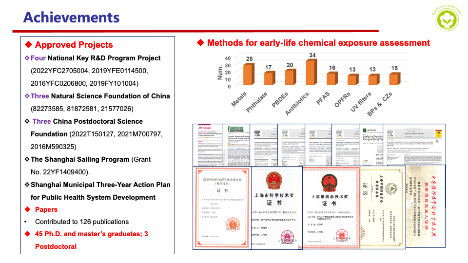

# 目前成果

2016年至今，依托队列基础资料，申请获得国家级项目9项，其中国家重点研发项目4项，自然基金项目5项；建设期间连续获得上海市第四轮和第五轮加强公共卫生体系建设重点学科项目“儿少卫生与妇幼卫生学”资助；并获得上海市科委资助项目2项；累计获得科研经费超过1700万元；并发表学术论文100余篇，主要发表于J Hazard Mater、Environ Int、Environ Pollut、Sci Total Environ、J Affect Disord，Nutrients，Nat Sci Sleep等国际知名期刊，以及中国学校卫生，卫生研究，环境与职业医学，中国儿童保健杂志等中文期刊。出版英文论著《Emerging chemicals and human health》。

