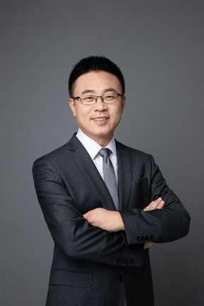

## **肖喜荣 主任医师，副教授，硕士研究生导师**

上海亲子队列运营专家顾问：负责指导出生队列研究对象招募和随访，包括参与制定招募标准、随访计划和内容。

复旦大学附属妇产科医院产前诊断与胎儿医学科副主任，住培基地主任助理。毕业于复旦大学上海医学院，曾赴新西兰奥克兰大学妇产科学系、美国班纳医学中心进修学习。主要研究方向为围产医学，擅长高危产科、胎儿生长受限及其他常见胎儿疾病的诊治。以第一或通讯作者发表论文39篇，其中SCI收录19篇，参编专著3部，实用新型专利2项，软件著作权2项。以第一申请人承担国家自然科学基金2项，上海市科委课题各1项。现任中国妇幼健康研究会孕产安全专业委员会委员，上海市医学会胎儿与宫内儿科医学分会委员，上海医学会科普分会青年委员。