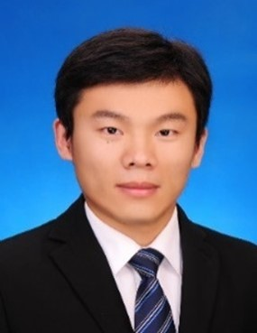

5. **赵岩 同济大学附属第一妇婴保健院研究员，博士研究生导师**

上海亲子队列流行病学专家顾问

东方英才计划（2023），上海市青年科技启明星计划 (2021)和上海市青年科技英才扬帆计划 (2018) 获得者。主要从事生殖流行病学相关的研究。以第一或者通讯作者发表SCI论文34篇，其中影响因子大于10分的SCI论文14篇，累计影响因子316.5。作为项目负责人主持科研项目8项，包括国家自然科学基金2项，省部级人才项目3项和校局级项目3项。曾获上海市科学技术奖三等奖和中华预防医学会科学技术奖三等奖。