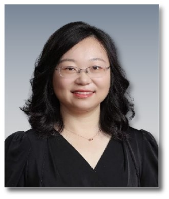

**2.**   **张蕴晖 上海亲子队列创始人、负责人**

**Yunhui Zhang,** **Principal Investigator**， Professor, Ph.D.

复旦大学公共卫生学院教授、博士生导师，环境卫生学教研室主任。长期从事环境健康领域的教学和科研工作，研究方向为新污染物的环境健康风险及分子机制。主持承担国家重点研发计划3项、国家自然科学基金5项、国际合作项目2项、教育部和上海市级项目多项，作为主要参加者参与了美国NIH和美国健康影响研究所等资助项目；已在国内外学术期刊上发表论文130余篇，其中24篇IF＞10；主编英文著作1本，副主编著作2部，主编科普读物2部；以第一完成人身份获教育部高等学校科学研究优秀成果奖自然科学二等奖、中华预防医学会科学技术奖三等奖、上海市科技进步三等奖和上海市优秀学术成果等奖项。

* Director of the Department of Environmental Health, Fudan University
* Innovatively developed multiple trace detection technologies and population health risk assessment tools.
* Contributed as the first/corresponding author to over 50 publications in esteemed journals.
* Second Prize of the Ministry of Education's Natural Science Award